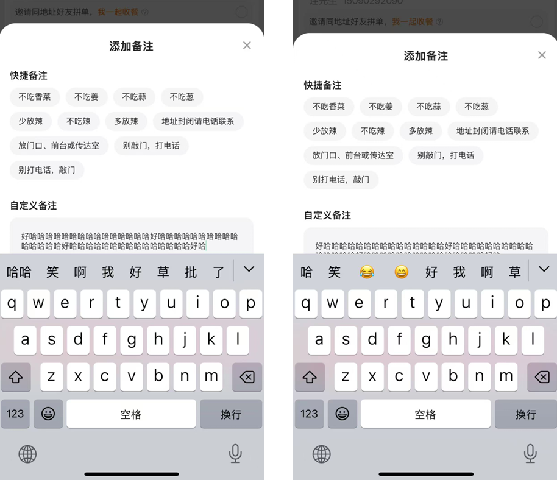
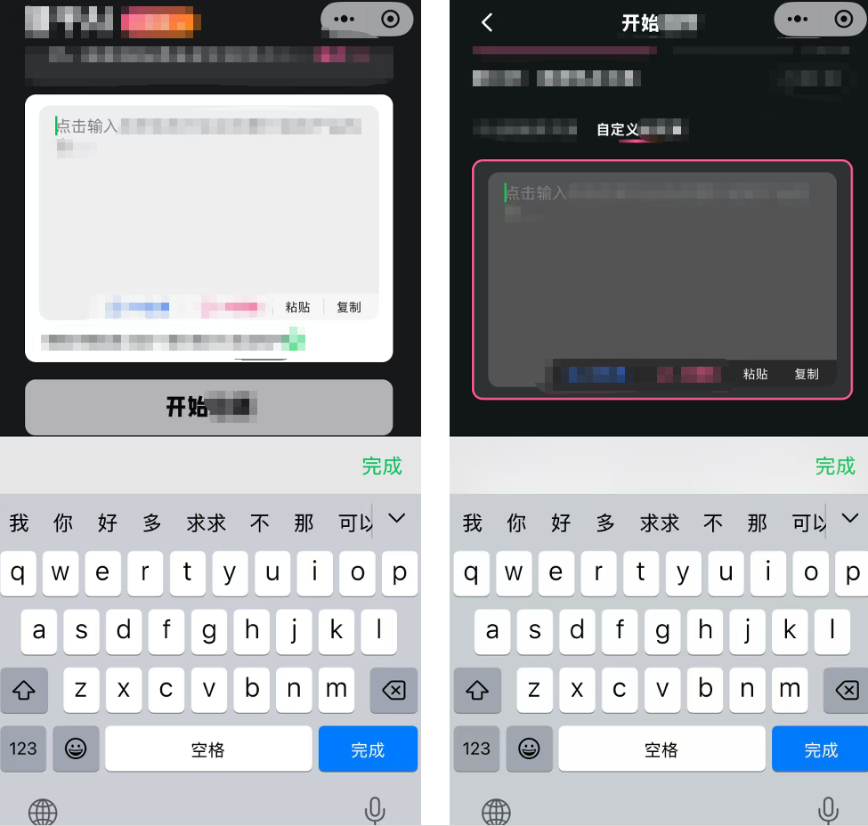

> **首先，解释一下什么是输入框在页面底部的情况？在我们日常使用大多数软件的时候可以发现，一些需要输入的框，一般占在页面的前三分之二部分，不会在很底部或者直接置底，因为这个可能会导致用户在聚焦输入框开始输入内容时，输入法键盘本身是有高度的，如果输入框在很底部的情况时键盘可能会遮挡输入框内容，导致用户无法实时查看输入内容。可以理解为，确实聚焦了这个输入框，但是只能输入却因为遮挡原因看不到输入内容了。**
> 
> **因此大部分情况下，如果输入框确实需要在页面底部出现，大多数解决方案是新开一个页面让用户去输入这个内容，或者在页面中间弹出悬浮层完成内容的输入。如果是遇到必须在当前页面当前位置完成输入，就可能考虑使用这种解决优化方案。**

## 1. 问题的表现是怎样的？

1. 本身uniapp包括微信小程序提供的输入框是支持一个属性的，就是自动上推页面功能，从系统上会依据输入法高度上推底层页面栈，但是如图你也可以看到另外一个小小的体验问题，如果输入框本身在很底部，系统只会上推以输入法的高度的像素，这可能会导致用户只能看见一行不能完整出现输入框主体。当然了如果是单行输入框就没有什么大的影响，如果是多行的时候，会影响用户使用体验。
2. 虽然输入框会自动上推，比如你输入了两行会自动上推到两行文字，但是如果用户需要拨回到第一行时那么第二行文字是遮挡的，这样一定程度可能会影响用户的使用体验。（如下图）

3. 理想状态下，用户在聚焦输⼊框时应当上推全部（即输入框主体全部），⾄少可以完整看⻅输⼊框主体，⽽不是只能看到 最新⼀⾏⽂字聚焦点。展⽰整体即⽅便⽤⼾上下滑动检查⽂字内容、⽅便⽤⼾选择指定⽂字复制粘贴、滑动复读等场景，也提⾼UI的美观度.....
## 2. 解决办法
- 仅供参考，你也可以用自己的解决办法
1. 如果你的业务需求必须是将输入框放在底部，或者页面的3/2以下的情况时，你可以参考这种解决方案
2. 首先uniapp它官方文档提供了一个获取键盘高度的生命周期API，uni.onKeyboardHeightChange，当键盘出现时或者用户调整了键盘高度变化时，都会触发这个回调方法
3. 然后，获取输入框的聚焦回调事件，实时依据输⼊法键盘⾼度改变并整体上推最底层⻚⾯栈，计算⻚⾯⾼度以及键盘⾼度和输⼊框的位置与⾼度信息，去计算出需要上推⻚⾯的⾼度像素值
4. 看起来不难，这里只是给出一个解决方案，具体实现你可以自己思考去做，如图：
