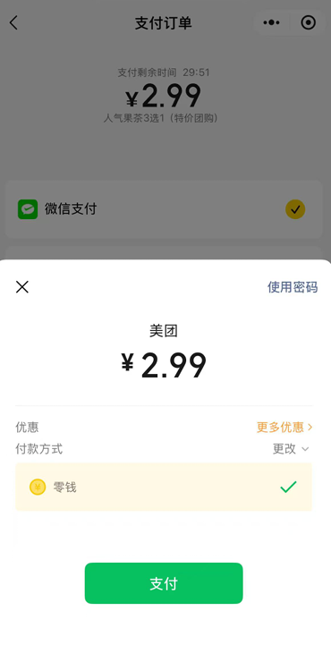

# 一、背景（引用微信文档的话）
### 1. 什么是虚拟⽀付？
虚拟⽀付是指购买⾮实物商品。⽐如：VIP会员、充值、录制课程、录制⾳频视频等虚拟产品。⽬前。*iOS端暂不⽀持虚拟⽀付。*
### 2.常⻅iOS虚拟⽀付违规类型有哪些？
1. 付费解锁优质服务：多体现为提供虚拟商品的⼩程序可通过⽀付购买、开通虚拟会员等形式，体验 ⼩程序付费服务。⽐如：⽀付阅读章节⼩说、同城⽣活服务平台付费发帖/付费置顶等。
2. 付费购买虚拟内容或道具：商品多体现为提前编辑好的、录制好的虚拟商品。如录制视频课程、游 戏道具。
3. 关闭iOS端虚拟⽀付功能后，虚拟商品⻚⾯仍然保留货架价格标签展⽰、购买/⽀付/订阅等功能或 按钮。
4. 关闭iOS端虚拟⽀付功能后，提供引导⽤⼾前往其他⽀付的路径/⽂案，完成虚拟⽀付闭环。
5. 关闭iOS端虚拟⽀付功能后，⼩程序中虚拟产品⻚⾯不可以含有付费性质的关键字（如：购买、已 购、付费、⽀付等），包括但不限于功能按钮、功能⻚⾯、⽀付提⽰及任何商品介绍等。
### 3.存在iOS虚拟⽀付的帐号将会受到怎样的处理？ 
1. 永封“iOS⽀付接⼝”功能，⼩程序iOS端将⽆法调起⽀付能⼒ 
2. 永封“iOS⽤⼾搜索⼩程序”功能，iOS端将⽆法在搜索栏中搜索到该⼩程序 
3. 下架7天限时整改通知，到期未整改，则永封“iOS⽤⼾打开⼩程序”功能：届时iOS端将⽆法打开 该⼩程序
### 4.官方推荐的3种整改 （其实等于扯淡，废话一样）
1. 关闭iOS付费通道 
2. 所有付费内容均更改为免费 
3. 前端直接拦截提⽰不可服务

参考文档：[ios虚拟支付](https://developers.weixin.qq.com/community/operate/detail/1006)、[# 公众号iOS虚拟支付行为的调整指引](https://developers.weixin.qq.com/community/develop/doc/00006c2a7f0980249d5cbe92151809)

# ⼆、虚拟支付解决方案
## 安卓端
- 可以正常直接在⼩程序调起微信⽀付

## ios苹果端
### 方案一、引导关注微信公众号从H5完成支付
- 第一步：用户在⼩程序内点击⽀付
- 第二步：弹窗出现⼀个公众号关注⼆维码
- 第三步：⽤⼾⼿动⻓按⼆维码
- 第四步：⽤⼾点击跳转公众号关注⻚ 
- 第五步：跳转进⼊公众号关注⻚
- 第六步：点击关注公众号（如果已经关注过公众号，就跳过这一步了）
- 第七步：公众号会给⽤⼾发⼀个卡⽚
- 第八步：点击这个打开这个卡⽚
- 第九步：进⼊到H5⽀付⻚⾯内完成支付调起工作
>✅优点：可以积累公众号关注用户量、留存用户流量
>
>❌缺点：操作繁琐，对用户来说可能比较难理解

### 方案二、引导进入小程序微信客服聊天对话框完成支付
- 第一步：用户在⼩程序内点击⽀付
- 第二步：点击右下⻆的⼩⽅块，发送给客服这个卡⽚
- 第三步：客服会给⽤⼾发⼀个卡⽚
- 第四步：点击这个打开这个卡⽚
- 第五步：进⼊到H5⽀付⻚⾯内完成支付调起工作
>✅优点：操作相对简单，比上面步骤少很多
>
>❌缺点：不能积累公众号关注用户量

# 三、特别注意
1. 以上给出的方案都是目前世面上主流在用的方案，但是其实都是**属于违反微信规定规则**的。
2. 可见文档说的，禁止引导到其他平台或第三方页面完成支付，比如公众号内H5内支付等
3. 官方给的建议是直接放弃让ios用户付费功能，可能这不是扯淡！从商业角度来说是根本不可行的
4. 但是其实目前大家都用这样完成iso支付功能的，微信其实也算是睁一只眼闭一只眼吧？那我们只能等未来有一天腾讯和苹果谈拢了，大公司博弈小公司只能跟着适应“环境”，这确实是没办法的。