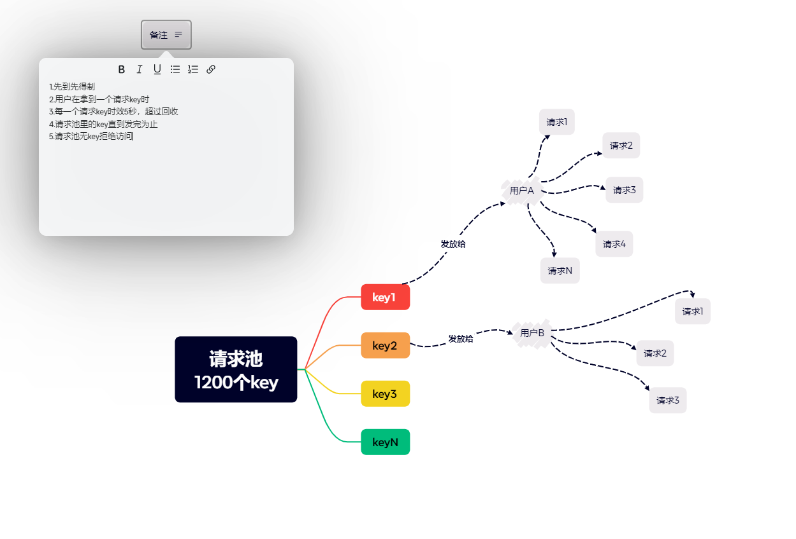

>之前接私活遇到过高并发的问题，就是在同一时刻可能会用多个用户抢注这个NFT商品卡片。为了防止用户用机器批量刷量请求和可能导致同一个NFT被多个人抢到的情况，于是就做出和提出了这个方案
## 实现解释
先看图：

整体的实现方案就是，做一个“请求keys池”，可以系统设置key的数量，具体就是为了控制高并发请求情况。
1. 例如系统设置100个key在这个池子里
2. 一个新的用户第一次请求接口会从这个池子里分发一个key给这个用户
3. 当这个keys池里的key消耗分发完之后就会让后期的用户等待，不过此时会像12306的火车票一样给他发一个候补标识
4. 如果有key的回收回来就按照候补列表给用户分发key
5. 假如候补用户列表是user1、user2、user3，keys池中刚刚回收来了1个key，如果user2先请求过来了就给user2，当然从候补列表就剔除它了
6. 当一个用户得到key之后，就可以对接口发起请求了，当然接口并发数也可以通过设置更改
7. 例如系统设置同一个key只能并发最多10个请求，那么就会做出相应的拦截
8. 此时就会有人发现一个问题了，如果一个用户拿到一个key之后一直刷请求占住这个key怎么办？
9. 首先做keys池限制的只有几个接口，比如购买接口、抢注接口，查询接口不做限制处理
10. 然后在用户每一次请求抢注接口时，会做一个行为列表记录，记录他的一些设备信息和ip等
11. 系统也会限制同一个key请求抢注接口的次数，比如用户刷请求过了限制数也会主动收回key
12. 也会有过期时间限制，对比用户上一次的请求时间，过1分钟没有请求就回收key
13. 记录设备信息和ip信息，会分析一些异常请求非法方式请求会直接回收key
从以上设计角度，可以有效防止高并发效果和一些恶意请求等问题，当然了，还是需要后端去做更复杂的请求处理和技术架构方案，我这里只是浅浅的分析和做出的方案，不喜勿喷！
